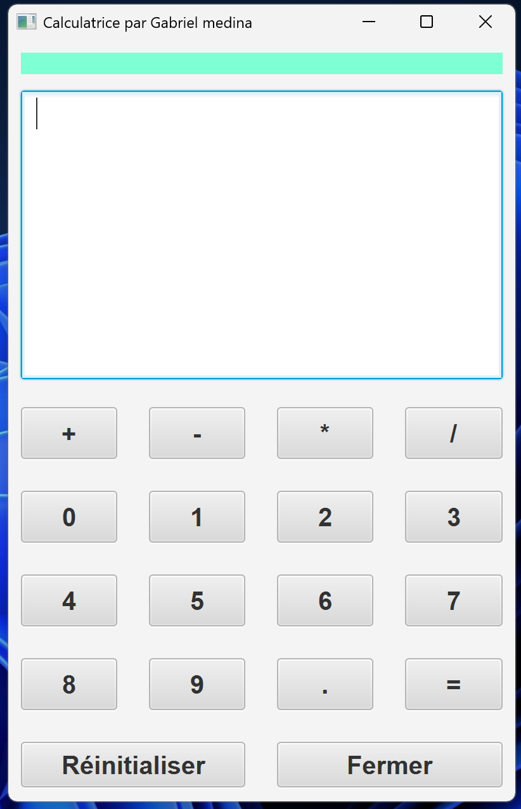
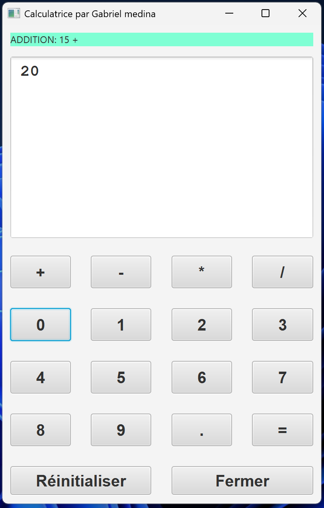
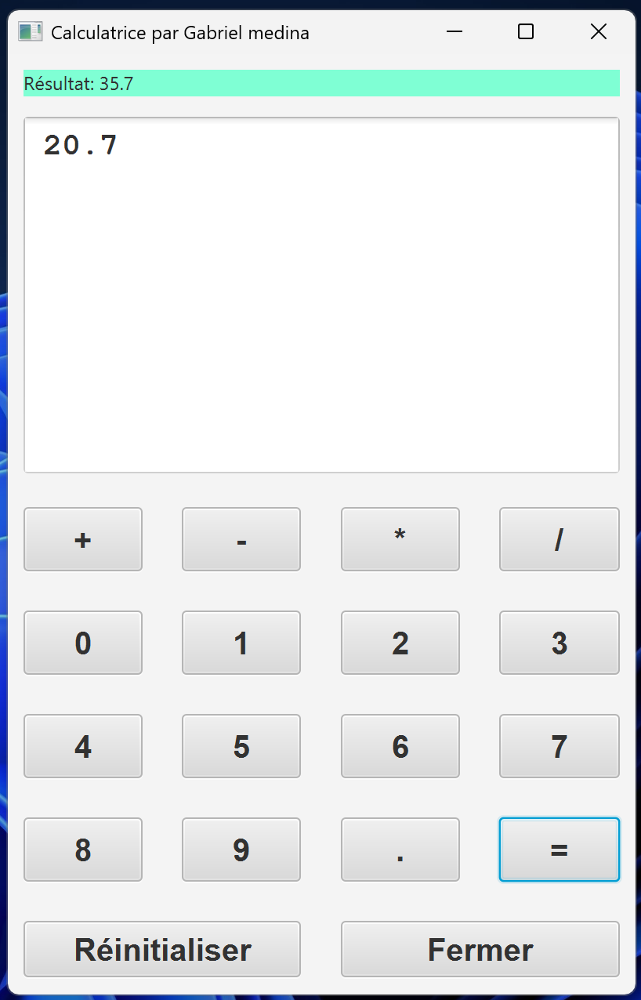

# JavaFX Calculator

A simple and elegant calculator application built with **Java** and **JavaFX**.  
This project demonstrates basic GUI design, event handling, and the integration of front-end and logic layers in JavaFX.

---

## 🧮 Overview

The **JavaFX Calculator** performs standard arithmetic operations within a clean and interactive user interface.  
It was created to practice **JavaFX layouts**, **controller logic**, and **event-driven programming**.

---

## ✨ Features

- Four basic arithmetic operations: **addition**, **subtraction**, **multiplication**, and **division**  
- **Clear** button to reset the input  
- **Error handling** for invalid inputs (e.g., division by zero)  
- Simple, responsive layout using **JavaFX GridPane** and buttons  
- Fully written in **Java**, with no external dependencies  

---

## 🖼️ Demo / Screenshot

